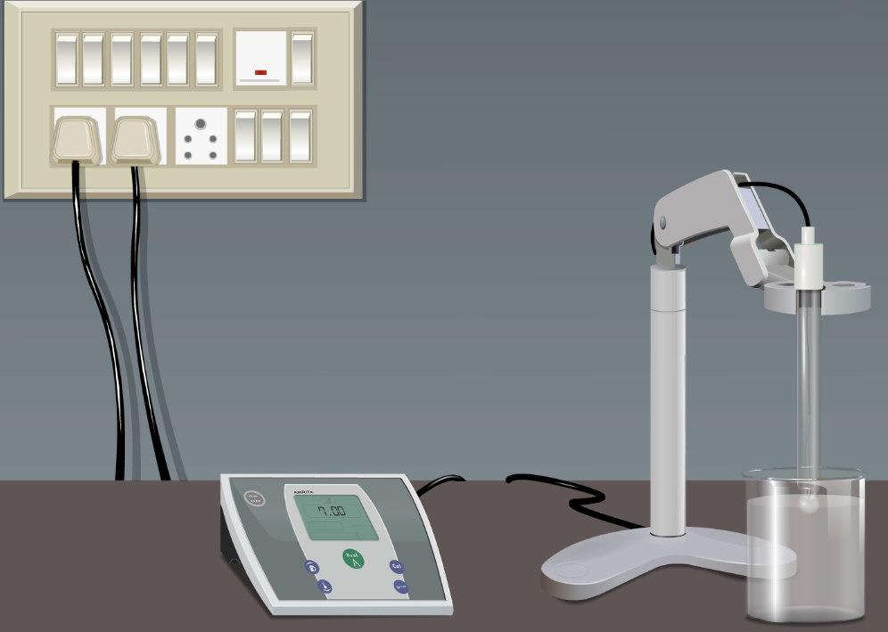

## Theory:

&nbsp;
 

Determination of pH plays an important role in the waste water treatment process. Extreme pH levels, presence of particulate matters, accumulation of toxic chemicals and increasing alkalinity levels are common problems in waste water. This becomes a serious environmental concern in recent years and hence municipal and industrial waste water treatments are critical before it enters to lakes, rivers, canals and other water bodies. The pH analyses are important for neutralization, precipitation, coagulation and other biological treatment process. pH analyses are probably the most recommended method for waste water treatment.

 
&nbsp;

The term “pH” refers to the measurement of hydrogen ion activity in the solution. Since the direct measurement of the pH is very difficult, specific electrodes are needed for quick and accurate pH determination. pH is measured on a scale of 0 to 14, with lower values indicating high H+ (more acidic) and higher values indicating low H+ ion activity (less acidic). A pH of 7 is considered as neutral. Every whole unit in pH represents a ten-fold increase in or decrease in hydrogen ion concentration. Most natural waters possess the pH values ranging from 5.0 to 8.5. Rain water have a pH value of 5.4 to 6.0 which then reacts with the soils and minerals causing the reduction in H+ ion concentration and thus the water may become alkaline with a pH 0f 8.0-8.5. More acid water (pH<5) and more alkaline (pH >9) and other immediate changes in the hydrogen ion concentration (pH) suggest that the quality of the water is adversely affected due to the introduction of some toxic contaminants in water bodies.

&nbsp;
 

pH is measured using pH meter, which comprises a detecting unit consisting of a glass electrode, reference electrode, usually a calomel electrode connected by KCl Bridge to the pH sensitive glass electrode and an indicating unit which indicates the pH corresponding to the electromotive force is then detected.  Before measurement, pH meter should be calibrated by using at least two buffers.  Also it is recommended to use hydrated silica gel for the glass electrode, and the electrodes must be soaked with water or in suitable buffer followed by rinsing in water. Electrode tips should be cleaned after use of wiping with tissue paper to remove adhering substances. Potassium level in the calomel electrode is maintained and the cap should be removed during measurement. For the accurate measurement of pH, the temperature of the buffer should be maintained for standardization of pH meter is same.

 

&nbsp;

 

**Figure 1: pH meter**

 

&nbsp;
 

Chemical and particulate contaminants in the water sample are thought to be destructive for the standard pH meters and thus some specialized pH electrodes are favored for determining the pH of waste water samples. For example, a double junction electrode works in such a way to block any chemical interference in the waste water thereby preventing the common damages to the reference electrode. Similarly a flushable junction acts on most of the chemical pollutants of the waste water and is ideal for sludge analysis.

 
&nbsp;

In anaerobic treatment of waste water, determination of pH is a critical factor, if the pH reduces below 5 is indicative of accumulation of acidic substances thus affecting the waste water treatment process. Similarly the shifting of pH beyond 10 also upsets the waste water treatment. Disinfection, coagulation of water, softening of water is controlled by the pH adjustments. Moreover, the higher pH levels in the water results in the formation of trihalomethanes, which is a major reason for causing cancer in humans.
 
